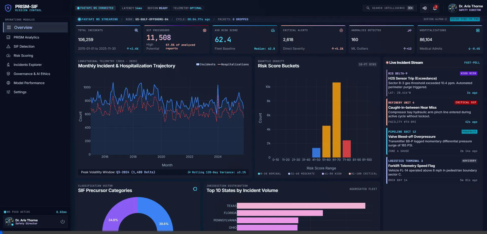
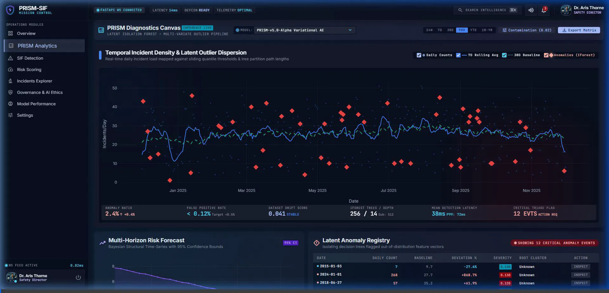

# PRISM-SIF — AI Safety Intelligence System

> **P**redictive **R**isk **I**ntelligence & **S**afety **M**anagement with **S**erious **I**njury/**F**atality Detection

An AI-powered HSE (Health, Safety & Environment) analytics dashboard for industrial safety, combining anomaly detection, NLP-based incident classification, and multi-factor risk scoring.

---

## 🎬 Demo Walkthrough

### Overview & PRISM Analytics


### SIF Detection, Risk Scoring, Incidents & Governance


---

## 🏗️ Architecture

```
PRISM-SIF/
├── app/
│   ├── main.py                 # FastAPI application entry point
│   ├── prism_analytics.py      # PRISM time-series & anomaly detection engine
│   ├── sif_detector.py         # NLP-based SIF precursor detection
│   ├── risk_scorer.py          # Multi-factor risk scoring engine
│   ├── templates/
│   │   └── dashboard.html      # Single-page dashboard (Tailwind + Plotly.js)
│   ├── api/v1/                 # RESTful API routes
│   │   ├── auth.py             # JWT authentication
│   │   ├── governance.py       # AI governance & ethics endpoints
│   │   ├── prism.py            # PRISM anomaly detection API
│   │   ├── risk.py             # Risk scoring API
│   │   ├── sif.py              # SIF detection API
│   │   └── users.py            # User management
│   ├── core/                   # Security & configuration
│   ├── db/                     # Database models & Alembic migrations
│   ├── ml/                     # ML pipeline (drift, explainability, fairness)
│   ├── services/               # Business logic services
│   └── workers/                # Kafka consumers for streaming
├── scripts/                    # Training & data preparation scripts
├── terraform/                  # AWS infrastructure as code
├── tests/                      # Pytest test suite
└── data_cleaning.py            # OSHA data preprocessing pipeline
```

---

## 🔬 Core Modules

### 1. PRISM Analytics
- **Isolation Forest** anomaly detection on daily incident time-series
- Rolling 7/30/90-day baselines with deviation scoring
- Exponential smoothing forecasts (30/60/90-day horizons)
- **Dynamic model switching** (v4.0 Ensemble, v4.1 Gradient, v4.2 IForest, v5.0 VAE)

### 2. SIF Detection
- NLP-powered Serious Injury/Fatality precursor classification
- Fine-tuned DistilBERT model on OSHA incident narratives
- Severity scoring (Critical / High / Moderate / Low)
- Category extraction (falls, struck-by, caught-in, electrocution, etc.)

### 3. Risk Scoring
- Multi-factor risk model combining:
  - Incident severity indicators
  - SIF precursor confidence
  - Historical patterns by employer/state
  - Hospitalization & amputation flags
- Geographic risk heatmap by jurisdiction

### 4. Governance & AI Ethics
- Model drift monitoring
- Fairness & bias metrics
- SHAP-based explainability
- Audit trail & compliance reporting

---

## 🚀 Quick Start

### Prerequisites
- Python 3.11+
- ~106K OSHA incident records (CSV in `data/cleaned/`)

### Installation
```bash
pip install fastapi uvicorn pandas scikit-learn numpy pydantic
```

### Run
```bash
uvicorn app.main:app --host 0.0.0.0 --port 8001
```

Open `http://localhost:8001` in your browser.

---

## 🛠️ Tech Stack

| Layer | Technology |
|-------|-----------|
| **Backend** | FastAPI, Python 3.11, Uvicorn |
| **ML** | scikit-learn (Isolation Forest), DistilBERT, SHAP |
| **Frontend** | Tailwind CSS, Plotly.js, Material Symbols |
| **Database** | SQLAlchemy + Alembic (PostgreSQL/SQLite) |
| **Infrastructure** | Terraform (AWS ECS, RDS, MSK, OpenSearch, S3) |
| **Auth** | JWT + RSA key pairs, LDAP integration |
| **Streaming** | Apache Kafka consumers |

---

## 📊 API Endpoints

| Endpoint | Method | Description |
|----------|--------|-------------|
| `/api/v1/stats` | GET | Dashboard KPIs |
| `/api/v1/prism/trends` | GET | Time-series trends (daily/weekly/monthly) |
| `/api/v1/prism/anomalies` | GET | Detected anomalies with model selection |
| `/api/v1/prism/forecast` | GET | 30/60/90-day risk forecasts |
| `/api/v1/sif/detect` | POST | Real-time SIF precursor detection |
| `/api/v1/sif/summary` | GET | SIF detection summary statistics |
| `/api/v1/risk/rankings` | GET | Top-N risk rankings |
| `/api/v1/risk/distribution` | GET | Risk score distribution |
| `/api/v1/risk/heatmap` | GET | Geographic risk heatmap |
| `/api/v1/incidents` | GET | Paginated incident explorer |
| `/api/v1/governance/*` | GET | AI governance metrics |

---

## 📄 License

This project is for academic and research purposes as part of the SIIH 2026 competition.
